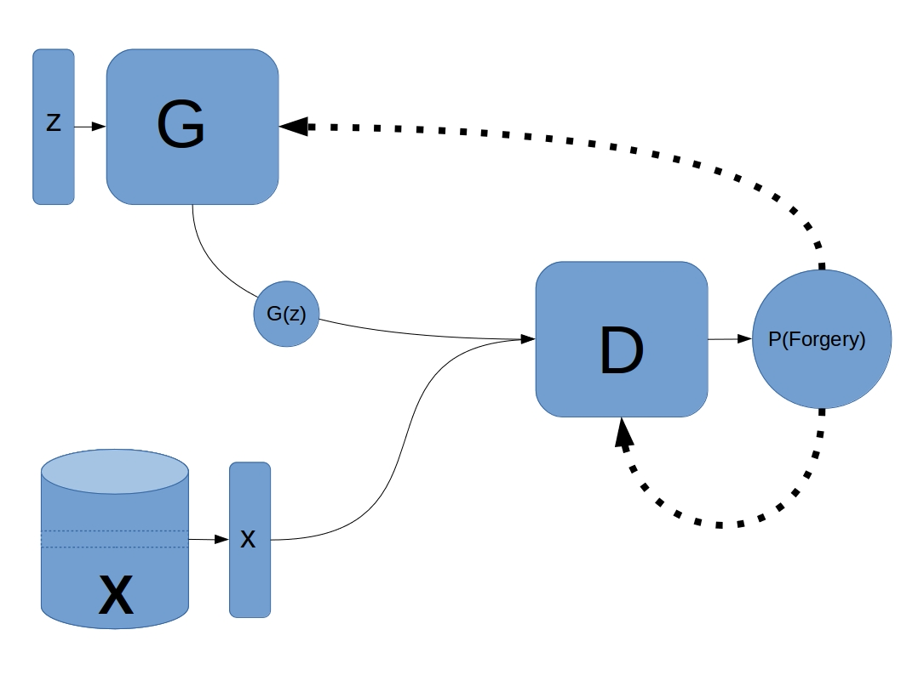
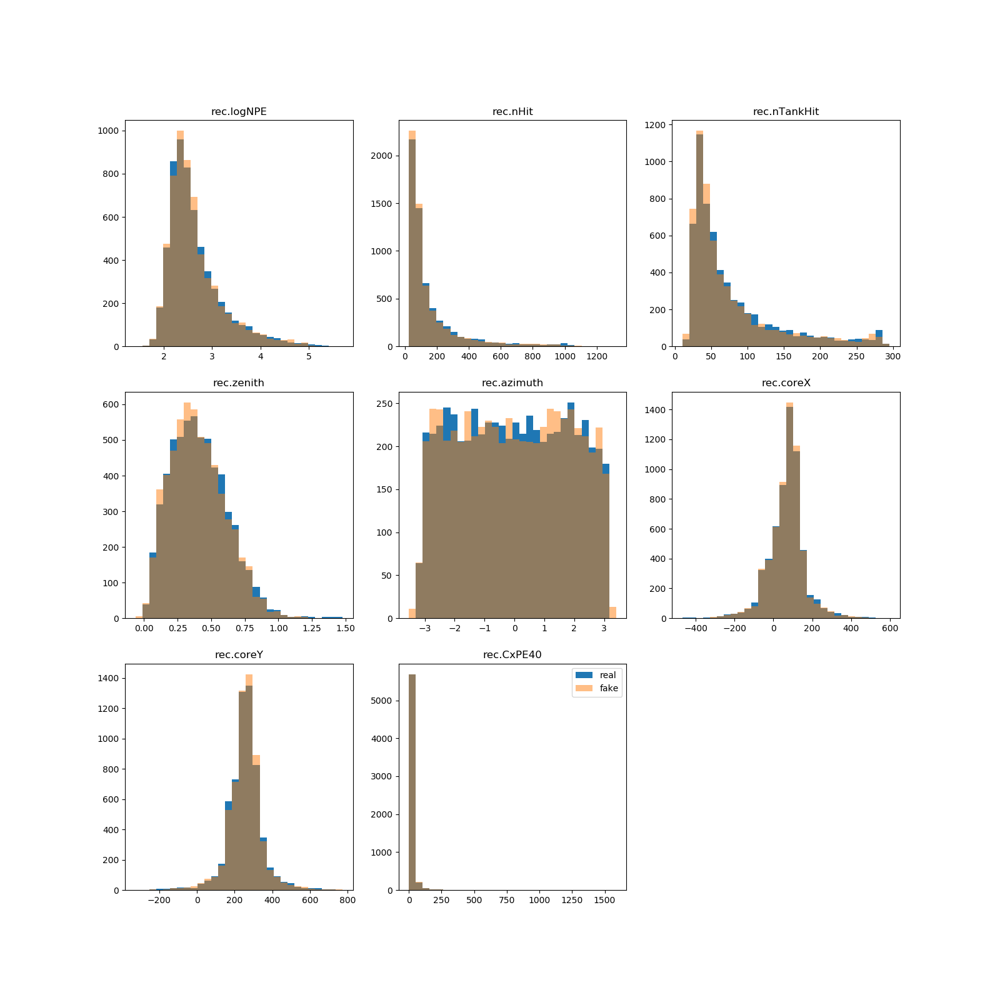

# HAWC Deep Learning

Deep learning models on HAWC simulation dataset

## Prerequisites
- A HAWC simulation dataset should be downloaded and placed in main directory, `$HAWC`
- XCDF from https://github.com/jimbraun/XCDF should be complied
    - contents of the compiled `lib/` folder, `libxcdf.so` and `xcdf/`, should be placed in the main directory
    - If getting errors with `libxcdf.so`, add it's location to `$LD_LIBRARY_PATH`
    - Make sure you're using python 2 and cython 2 with XCDF
- Install python packages with `pip install -r requirements.txt` (preferably in a Conda or virtualenv environment)

## Overview
### Data Processing
`parse_hawc.py` reads in data from the `$HAWC` folder and generates the training and testing datasets for our experiments.

To generate the dataset, run 
``` bash
python parse_hawc.py $HAWC
``` 
The dataset will be stored in `$HAWC/data`

For PMT data from grid hit events, we use a mapping of PMTs to specific coordinates of a 40x40 grid, defined in `squaremapping.py`

Note: because there are more coordinates (1600) than PMTs (<1200), some coordinates will always have 0 value if they don't correspond to a PMT.

### Plotting
`plot.py` contains many visualization functions. It can visualize data from XCDF files (called in `parse_hawc.py`).

We can visualize the actual structure of the HAWC grid of PMTs. It's clear that some data is unintialized and we clean it during processing.


Here are some visualizations of data from our dataset:


## Deep learning Models and Experiments
### What is a GAN? A Physicists Primer Into Generative Models
GAN is short for Generative Adversarial Neural Network, and it is part of a family of deep learning models called "Generative Models".  A GAN is composed of 3 parts; the generator G, the discriminator D, and the expert sample X.  Traditionally, the generator and discriminator are neural networks, while the expert sample is a sample of the distribution you are trying to mimic.  The generator network takes in a vector of random noise z (which it needs as an entropy source), and produces an output that has the same form as that of the expert sample, G(z).  The Discriminator takes in a sample (either from the generator, G(z), or the expert sample x), and returns the probability that the sample is a forgery from the generator.  The model parameters of the generator are tuned to minimize D(G(z)) while the parameters of the generator are turned to maximize D(G(z)) and minimize D(x).  The end result is a mathematical arms race between G and D (they are "adversaries"), which slowly moves the distribution G(z) closer and closer to the expert sample X.  You can learn more about GAN models here; https://github.com/hwalsuklee/tensorflow-generative-model-collections



This is a fundamentally different approach to distribution sampling compared that employed by physicists, as no knowledge of the mathematical form of the expert distribution is needed.  The only requirement is that the expert sample is "large enough" to express the distribution.  What is and isn't "large enough" is a question that is the subject of ongoing research, so developing a functional GAN model requires some amount of numerical experimental work to be done.

A question that a physicist might ask is this; "Why are GANs useful?  How can a GAN help us learn something about physics?".  While it is true that a GAN can be expressed mathematically, the expression is not useful to a physicist.  Such an expression would take the form of something akin to a Fourier series, which doesn't nescissarily tell you anything useful about what's actually being described by the model.  To a physicist, knowing that some distribution is Gaussian or Poissonian is much more useful that being able to draw samples from it.  So why use GANs at all?

The key is this;  most statistical physics simulations can be represented by a generative model.  The final output for a simulation might contain many reconstructed parameters, but only a few of those might be useful for analysis.  Those few parameters can be though of samples from a very high dimensional joint probability distribution.  A generative model can learn this joint distribution, and then generate new simulated events through sampling.

For HAWC, this simulation pipeline is long, complex, and difficult to tune.  It takes roughly 11 days to run a full simulation of HAWC, from the generation of CORSIKA showers all the way to the final reconstruciton.  This is because HAWC is a high duty cycle, high statistics experiment.  In order for a simulation to be useful, HAWC requires enough simulated events to do a statistical analysis.  At the moment, "enough simulated events" is around 8 billion in total (3 billion each for gammas and protons, 1.3 billion ish for helium, and the rest are spread across the other primaries)

GANs offer a significantly faster method for generating simulation events.  Only a sample of the simulation needs to be generated, and then a GAN can quickly generate the rest.

### 1D Distribution Generation with Non-Conditional GANs
This GAN is a simple MLP model that has been trained exclusively on the gamma ray simulation.  It accepts a vector of random draws from an 8D standard spherical gaussian.  The output of this model is  rec.logNPE, log(rec.nHit), rec.nTankHit, rec.zenith, rec.azimuth, rec.coreX, rec.coreY, and rec.CxPE40.

To run param-gen/parameterGAN.py, run gen_gamma_params("/path/to/gamma") in parse_hawc and specifcy paramters to collect in the function. Then run in `param-gen/`: 

```bash
python parameterGAN.py
```
Histograms for the generated and actual distributions will be written to the paramGANplots folder in the same directory. An example of a generated histogram is shown below.



This model trains to near completion in less than an hour on a GeForce GTX 180 Ti.

### 1D Distribution Generation with Conditional GANs
The 1D parameter GAN can be modified slightly, allowing for conditional inputs.  Along with the 8D entropy vector, another set of input parameters can be appended.  In this case, these parameters are log(SimEvent.energyTrue), SimEvent.thetaTrue, and SimEvent.phiTrue.  These values are also included as an input to the discriminator.  During training, the GAN samples the input params from the real simulation, and generates an output.  The sampled params and the generated output are passed to the discriminator.  

### 2D Distribution Generation with WGANs
### Generative Model with Pixel-cnn
We can use a pixel-cnn model to generate very realistic PMT grid hit data.

To run pixelcnn on the 40x40 images generated from above, run
```bash
cd pixel-cnn
sh scripts/train.sh
```
Checkpoints and output from pixelcnn will be located in `$HAWC/saves`, which can then be visualized with

```bash
python plot.py [epoch number of checkpoint]
```
Here is an example of generated samples from pixel-cnn. From inspection, it seems as if the pixel-cnn model learns to generate a distribution of samples that is representative of the varying sparsity between hits, and the smooth falloff of charge from a specific point indicative of gamma data.


