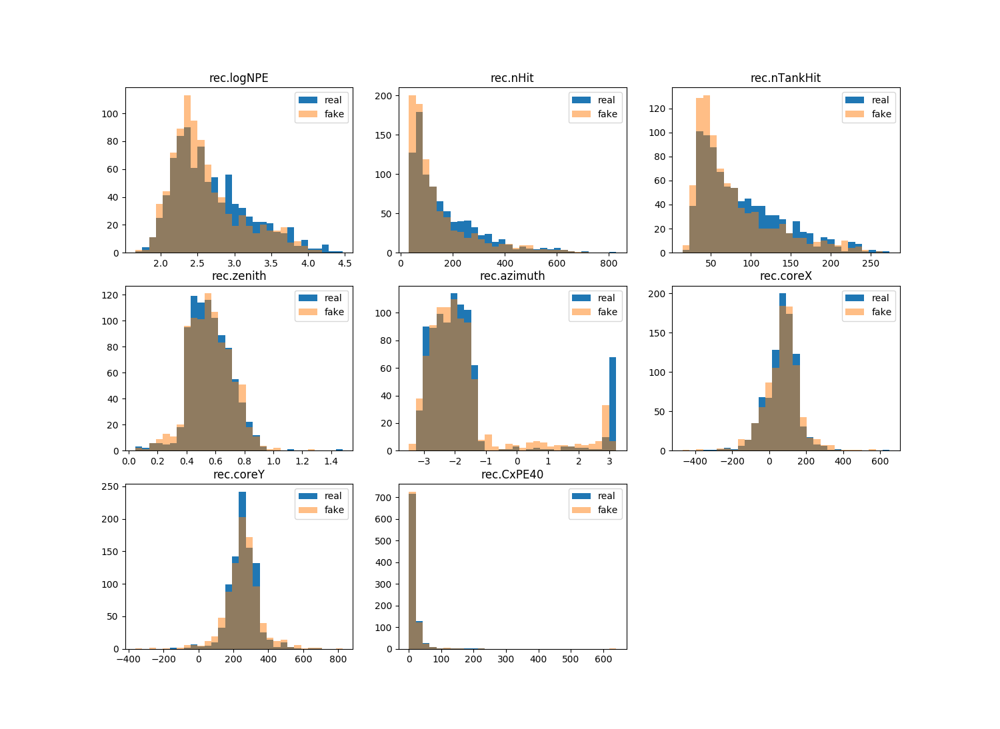

# HAWC Deep Learning

Deep learning models on HAWC simulation dataset

## Install conda if necessary
```shell
wget https://repo.continuum.io/miniconda/Miniconda3-latest-Linux-x86_64.sh
sh ./Miniconda3-latest-Linux-x86_64.sh -b -p
export PATH="$HOME/miniconda/bin:$PATH"

conda create --name hawc python=2.7
source activate hawc
conda install cython matplotlib numpy scipy imageio pytorch torchvision cuda90 -c pytorch
pip install tensorflow-gpu==1.8.0
```

## Prerequisites
- A HAWC simulation dataset should be downloaded and placed in `$HAWC`
- XCDF from https://github.com/jimbraun/XCDF should be complied to `$XCDF`
    - contents of the compiled `$XCDF/lib/` folder should be placed in the root directory, or link in `$LD_LIBRARY_PATH`
    - Make sure you're using python 2 and cython 2 with XCDF

To download this repository, run 
```shell
git clone --recurse-submodules https://github.com/arcelien/hawc-deep-learning.git
cd hawc-deep-learning
```

## Overview
### Data Processing
`parse_hawc.py` reads in data from the `$HAWC` folder and generates the training and testing datasets for our experiments.

To generate the dataset, run 
```shell
# generate the coordinates of the PMT by reading a XCDF file (for visualization later)
python parse_hawc.py --hawc-dir $HAWC --save-dir [dir to save data in] --gen layout
# generate the specified data files
python parse_hawc.py --hawc-dir $HAWC --save-dir [dir to save data in] --gen [one-channel-map or two-channel-map or one-dim]
``` 

For PMT data from grid hit events, we use a mapping of PMTs to specific coordinates of a 40x40 grid, defined in `squaremapping.py`

Note: because there are more coordinates (1600) than PMTs (<1200), some coordinates will always have 0 value if they don't correspond to a PMT.

### Plotting
`plot.py` contains many visualization functions. It can visualize data from XCDF files (called in `parse_hawc.py`).

We can visualize the actual structure of the HAWC grid of PMTs. It's clear that some data is unintialized and we clean it during processing.

 

Here are some visualizations of data from our dataset:

 

## Deep learning Models and Experiments

### 1D Distribution Generation with Non-Conditional GANs
This GAN is a simple MLP (Multi Layer Perceptron) model that has been trained exclusively on the gamma ray simulation.  It accepts a vector of random draws from an 8D standard spherical gaussian.  The output of this model is  rec.logNPE, log(rec.nHit), rec.nTankHit, rec.zenith, rec.azimuth, rec.coreX, rec.coreY, and rec.CxPE40.

To run param-gen/parameterGAN.py, run gen_gamma_params("/path/to/gamma") in parse_hawc and specify paramters to collect in the function. Then run in `param-gen/Vanilla 1DGAN/`: 

```bash
python parameterGAN.py
```
Histograms for the generated and actual distributions will be written to the paramGANplots folder in the same directory. An example of a generated histogram is shown below.


This model trains to near completion in less than an hour on a GeForce GTX 1080 Ti.

### 1D Distribution Generation with Conditional GANs
The 1D parameter GAN can be modified slightly, allowing for conditional inputs.  Along with the 8D entropy vector, another set of input parameters can be appended.  In this case, these parameters are log(SimEvent.energyTrue), SimEvent.thetaTrue, and SimEvent.phiTrue.  These values are also included as an input to the discriminator.  During training, the GAN samples the input params from the real simulation, and generates an output.  The sampled params and the generated output are passed to the discriminator.  The output of this model is as before; rec.logNPE, log(rec.nHit), rec.nTankHit, rec.zenith, rec.azimuth, rec.coreX, rec.coreY, and rec.CxPE40.  

To run this model, you should run gen_gamma_params("/path/to/gamma") in parse_hawc with the varable `params = ...` set to 11 parameter names (will generate 8 distributions from 3 conditions). Next, make 2 folders "saved" and "paramGANplots" and run in `param-gen/Conditional 1DGAN/`:

```bash
python parameterCGAN.py
```

After training, the saved models should be in the "saved" folder. Specicify the saved model by file directory in `CGANvisualization.py` and run with python to visualize the generated distributions.

The effects of the conditional inputs can be seen in the following tests.  First, we left the conditional variables free and sampled the inputs from uniform distributions.  This shows how much variation the generative model can express.


We also passed input values from the simulation directly to the generative model, which illustrates just how well the model is able to capture the source distribution.



Differences here, especially in the distributions with hard cutoffs, comes from a combination of using only gaussians as the input entropy source, and training time.  

This model was trained to near completion in less than an hour on a GTX 1080 Ti

### 2D Distribution Generation with WGANs
We can extend the 1D GAN to the 2D domain via 2D GANs and WGANs. To increase stability, we use the WGAN model which entails simply changing the loss function.

To run the 2D GAN, the data needs to first be processed by `parse_hawc.py`. To run either a vanilla (normal loss) GAN or WGAN, go to `image-gen/` and choose either `Vanilla DCGAN/` or `Wasserstein DCGAN/`. In the `Vanilla DCGAN/` there must be a "plots" and "saved" folder and in `Wasserstein DCGAN/` there must be a "tmp" folder. The generated images should go to plots and tmp respectively. Finally run

```bash
python train.py
```
to train the model.

Here is an example of the current 2-channel GAN.


### Generative Model with PixelCNN
We can use a PixelCNN (https://arxiv.org/abs/1601.06759) model to generate very realistic PMT grid hit data. Because we can map each simulation event to a 40x40 array, we can use a generative model like PixelCNN to sample images corresponding to events.

To run PixelCNN on the 40x40 images generated from above, run
```shell
cd pixel-cnn
python train.py --save_dir [dir to save pixel-cnn output] --data_dir [where processed data was saved to] --save_interval 3 --dataset [hawc1 or hawc2] (--nosample if no matplotlib)
```
Checkpoints and output from PixelCNN will be located in `$HAWC/saves`, which can then be visualized with

```shell
python plot.py --num [epoch number of checkpoint] --chs [1 or 2] --data-path [dir of processed HAWC data (layout.npy)] --save-path [dir of pixel-cnn output]
```
Here is an example of generated samples from PixelCNN. From inspection, it seems as if the PixelCNN model learns to generate a distribution of samples that is representative of the varying sparsity between hits, and the smooth falloff of charge from a specific point indicative of gamma data.


### Two channel generation
We then extend our PixelCNN model to generate a simulation event including both the charge and hit time recorded at each PMT.

We ran the model on a NVIDIA Tesla V100 16GB GPU; training takes 2170 seconds (36 minutes) per epoch (entire set of gamma images). 

Because the model converges and can generate very realistic iamges after only 3-6 epochs of training, it takes less than two hours to train this model. A small additional improvement in the metric (bits per dimension) can be realized after training for a full day, but images look equally realistic to the human eye.

Unfortunately, PixelCNN is not a fast model for sampling, and it takes 272 seconds to generate a batch of 16 images (17 seconds per image)

Here is a visualization where the first channel is log charge, and the second is hit time (normalized).


### Fast PixelCNN Sampling
We can apply a method to cache results while generating images (https://github.com/PrajitR/fast-pixel-cnn) to speed up the two channel image sampling process significantly. This new sampling technique gets an initial, signficiant speedup over the original while using the same batch size, and it scales with batch scale in near constant time - increasing the batch size does not increase sampling time.

On a GTX 1080 ti, it took less than 82 seconds to generate a batch of 512 images (0.16 seconds / image). Compared to the 272 seconds to generate a batch of 16 on a Teslta V100 from before (17 seconds / image), this generation technique is over 100 times faster.

The number of images per batch is limited by the ammount of GPU memory, and we ran out of memory when trying a batch of size 1024. On a GPU with 32 GBs of memory (new Telsa V100), it shoould be able to generate a batch of size `32/11*512 ~ 1500` in the same amount of time (0.05 seconds / image). 

Run the fast generation with the following command:
```shell
# generate new images
cd fast-pixel-cnn
python generate.py --checkpoint [PixelCNN save directory]/params_hawc2.ckpt --save_dir [location to save images] --batch-size [max size that fits on GPU]

# now visualize results
cd ..
python plot.py --num [iteration number to view] --chs 2 --data-path [dir of processed HAWC data] --save-path [save dir from above]
```

Here is a sample of 16 generated by the fast version of PixelCNN. From inspection, the results look very close to the original.


### Conditional PixelCNN
Similiar to the approach to condition a 1D GAN on labeled inputs, we can condition the samples generated by a PixelCNN model by passing in image-label pairs, where the labels will be included in the latent space and passed through the network. 

Run the model by passing in an additonal command line argument of `-c` to the PixelCNN train file. See `pixel-cnn/train-cond.sh` for an example.

Conditioning on variables allows us to generate events corresponding to an arbitrary set of variables - we can condition on any labeled variable associcated with the events in our dataset.

Here is a visualization of a PixelCNN model conditioned on `rec.azimuth`:
`to be added`
